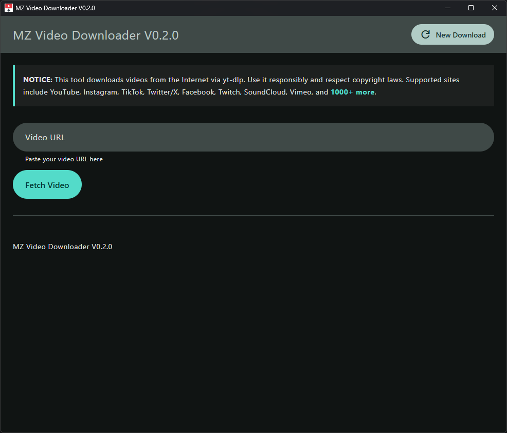
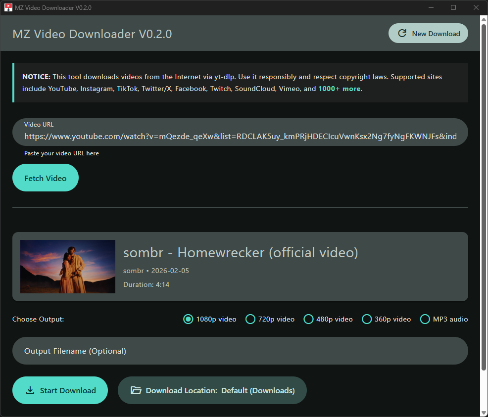
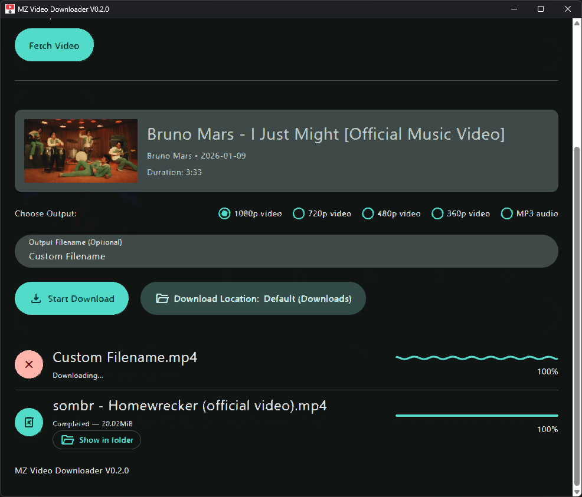
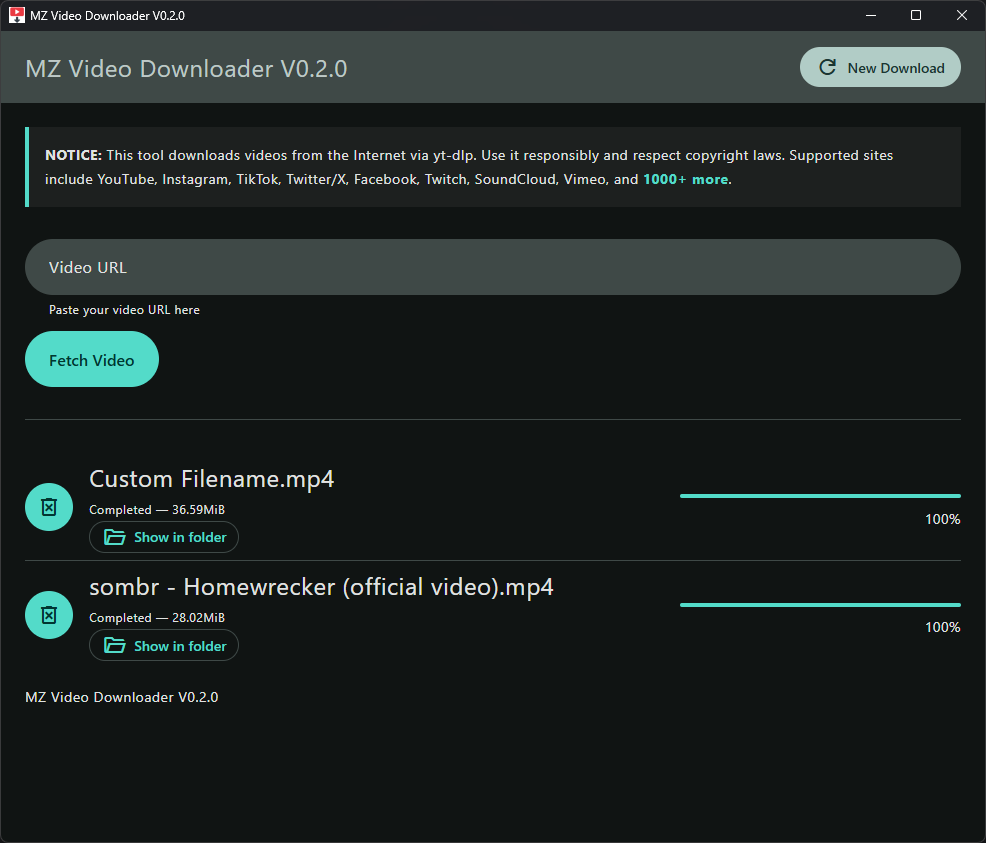

# MZ Video Downloader

A lightweight Electron desktop app for downloading videos from YouTube, Instagram, TikTok, Twitter/X, Facebook, Twitch, SoundCloud, Vimeo, and [1000+ more sites](https://github.com/yt-dlp/yt-dlp/blob/master/supportedsites.md) — powered by [yt-dlp](https://github.com/yt-dlp/yt-dlp) and ffmpeg.

## Screenshots

## Features

- **Multi-format downloads** — 1080p, 720p, 480p, 360p video (MP4) or MP3 audio
- **Batch downloads** — queue multiple videos simultaneously
- **Real-time progress** — speed, ETA, and file size shown during download
- **Custom save location** — pick any folder per session
- **Auto-paste URL** — clipboard URL is pasted automatically on focus
- **Smart error messages** — identifies private, unavailable, age-restricted, and geo-blocked videos
- **Clean UI** — built with BeerCSS (Material Design 3)

## System Requirements

- **OS:** Windows 10 / 11 (x64)
- **No installation required** — single portable `.exe`

## Supported Sites

YouTube, Instagram, TikTok, Twitter/X, Facebook, Twitch, SoundCloud, Vimeo, and [1000+ more](https://github.com/yt-dlp/yt-dlp/blob/master/supportedsites.md).

## How To Use

1. **Paste URL** — copy a video link; it auto-pastes when you click the URL field
2. **Fetch Video** — click **Fetch Video** (or press Enter) to load title, thumbnail, and duration
3. **Choose Format** — select quality (default: 1080p) or MP3 audio
4. **Select Location** — (optional) click **Download Location** to change save folder
5. **Download** — click **Start Download**; progress, speed, and ETA update in real time
6. **Open File** — click **Show in folder** once download completes
7. **New Download** — click **New Download** (top right) to download another video

## Troubleshooting

| Problem | Cause | Fix |
|---|---|---|
| "Video is private" | Video requires login | Use a public video |
| "Age-restricted" | Platform requires sign-in | Not supported |
| "Geo-blocked" | Not available in your region | Use a VPN |
| Audio won't play on Windows | Opus codec not supported by Windows Media Player | Download again — app now prefers AAC |
| Download fails | yt-dlp outdated | Replace `yt-dlp.exe` in the app's bin folder with the latest from [yt-dlp releases](https://github.com/yt-dlp/yt-dlp/releases) |

## Changelog

**V0.2.0**
- Removed yt-dlp auto-update feature
- Fixed startup crash on Electron 40
- Fixed audio downloads producing double extension (`.mp3.mp3`)
- System font fallback (Arial / system-ui) for consistent UI across machines

**V0.1.0**
- Initial release
- Multi-format video/audio download via yt-dlp + ffmpeg
- Real-time progress with speed, ETA, and file size
- Smart error messages for private/unavailable/geo-blocked videos
- Auto-paste URL from clipboard on focus
- Open downloaded file location from UI
- Duplicate download guard
- AAC audio preference for YouTube (fixes Windows playback issue)
